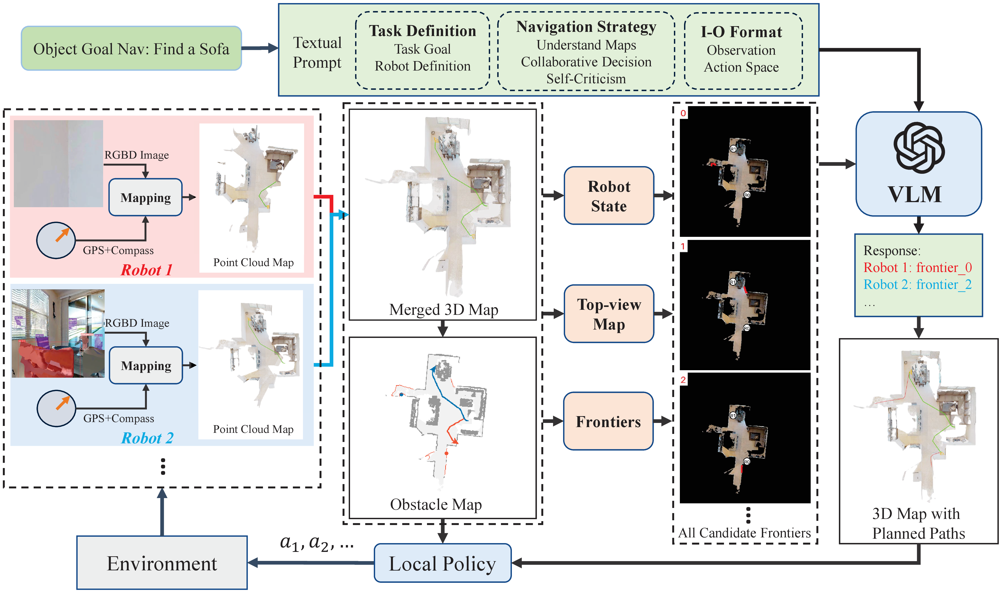

# Towards Collaborative Semantic Visual Navigation via Vision Language Models

[**Project Page**](https://sites.google.com/view/co-navgpt2)

We proposed a new framework to explore and search for the target in unknown environment based on Vision Language Model. Our work is based on [VLN-Game](https://sites.google.com/view/vln-game). You can find the code of this paper about simulation and real-world implementation in ros2 foxy.

**Author:** Bangguo Yu, Qihao Yuan, Kailai Li, Hamidreza Kasaei, and Ming Cao

**Affiliation:** University of Groningen

## Abstract

Visual target navigation is a critical capability for autonomous robots operating in unknown environments, particularly in human-robot interaction scenarios. While classical and  earning-based methods have shown promise, most existing approaches lack common-sense reasoning and are typically designed for single-robot settings, leading to reduced efficiency and robustness in complex environments. To address these limitations, we introduce Co-NavGPT, a novel framework that integrates Vision-Language Models (VLMs) as global planners to enable common-sense multi-robot visual target navigation. Co-NavGPT aggregates sub-maps from multiple robots with diverse viewpoints into a unified global map, encoding robot states and frontier regions. The VLM uses this information to assign frontiers across the robots, facilitating coordinated and efficient exploration. Experiments on the Habitat-Matterport 3D (HM3D) demonstrate that Co-NavGPT outperforms existing baselines in terms of success rate and navigation efficiency, without requiring task-specific training. Ablation studies further confirm the importance of semantic priors from the VLM. We also validate the framework in real-world scenarios using quadrupedal robots.



## Installation

The code has been tested only with Python 3.8, CUDA 12.1.

### Installing Dependencies
- Setup the conda environment as Python3.8 + CUDA11.8 + PyTorch2.0.1.
    ```
    conda create -n co-nav anaconda python=3.8 cmake=3.14.0
    conda activate co-nav
    conda install pytorch==2.0.1 torchvision==0.15.2 torchaudio==2.0.2 pytorch-cuda=11.8 -c pytorch -c nvidia
    ```

- We use adjusted versions of [habitat-sim](https://github.com/facebookresearch/habitat-sim) and [habitat-lab](https://github.com/facebookresearch/habitat-lab) as specified below:

- Installing habitat-sim:
```
git clone https://github.com/facebookresearch/habitat-sim.git
cd habitat-sim; git checkout tags/v0.2.1; 
pip install -r requirements.txt; 
python setup.py install --headless
python setup.py install # (for Mac OS)
```

- Installing habitat-lab:
```
git clone https://github.com/facebookresearch/habitat-lab.git
cd habitat-lab; git checkout tags/v0.2.1; 
pip install -e .
```

- Clone the repository and install other requirements:
```
git clone https://github.com/ybgdgh/Co-NavGPT2
cd Co-NavGPT/
pip install -r requirements.txt
# replace the habitat folder in habitat-lab rope for the multi-robot setting: 
mv -r multi-robot-setting/habitat enter-your-path/habitat-lab
```

### Download HM3D_v0.2 datasets:

Download [HM3D](https://aihabitat.org/datasets/hm3d/) dataset using download utility and [instructions](https://github.com/facebookresearch/habitat-sim/blob/main/DATASETS.md#habitat-matterport-3d-research-dataset-hm3d):
```
python -m habitat_sim.utils.datasets_download --username <api-token-id> --password <api-token-secret> --uids hm3d_minival_v0.2
```

## Setup


### Setting up datasets
The code requires the datasets in a `data` folder in the following format (same as habitat-lab):
```
Co-NavGPT/
  data/
    scene_datasets/
    versioned_data
    datasets/
        objectnav_hm3d_v2/
            val/
```

### Setup Openao API
```
export OPENAI_API_KEY="your_api_key_here"
```

### For evaluation: 
For evaluating the multi-robot object-goal navigation task, run:
```
python main.py
```
For multiprocessing, run:
```
python main_vec.py
```

You can also add `-v 1` to enable the Open3D visualization UI to check the maps, and `-n 1` to set the number of multiprocessing for `main_vec.py`.

## Real-world Implementation


You can find the code that how to use two Unitree Go2 robots to run the multi-robot visual target navigation in the unknown real world using ROS2 foxy. Each robot equiped with the RealSense D455 camera and Livox MID 360 lidar.

1. Install [ROS2 foxy](https://docs.ros.org/en/foxy/Installation.html) environment in Python 3.8 (ROS2 humble should also work well).

2. Install related dependencies in the same conda environment as simulation (**conda activate co-nav**):
    ```
    sudo apt-get install ros-<ros_distro>-tf-transformations
    sudo pip3 install transforms3d
    pip install numpy-quaternion
    ```
3. Config your real robots and sensors following this [instruction](https://docs.ros.org/en/foxy/Installation.html). Each robot has its namespace with robot ID, such as `robot_0`, `robot_1`, ....
4. Enable the conda environemnt
   ```
   conda activate co-nav
   ```
5. Start all your robots and sensros. Let two robots stand side by side, facing forword together, with an initial distance of approximately 1.5 meters between them. Then calculate the registration between two robots using G-ICP by running:
   ```
   python multi_lidar_icp.py
   ```
   You will find the static transform of the registration in the terminal, and run it. For example:
   ```
   ros2 run tf2_ros static_transform_publisher -0.3489087452591184 1.6667295859539184 0 0.007028384544181147 -0.005619125549335727 0.10024310851203151 0.9949222816052544 camera_init_2  camera_init_1
   ```
   This `static_transform_publisher` is used to connect the two robots' tf2, then all the sensors' data can be transformed in the same coordinate system. You can also change the icp_initial_transform in `multi_lidar_icp.py` based on the formation of your robots.

6. For multi-robot visual target navigation, run:
   ```
   python ros_multi_nav.py
   ```
   Each robot will rotate around firstly to initial the environment map, then start navigation following the assignment of the VLM. You can also test your setup for each single robot with frontier-based exploration to verify the configurations before running the multi-robot experiment:
   ```
   python ros_singel_nav.py 
   ```

   You can also add `-v 1` to enable the Open3D visualization UI to check the map.


